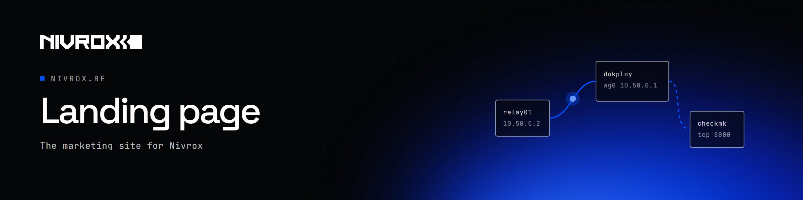
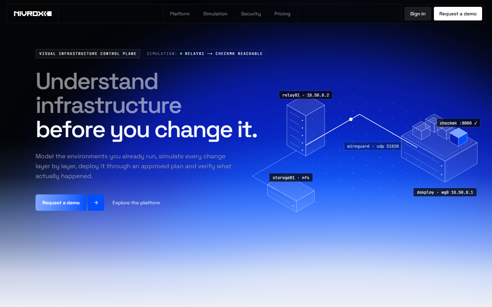

<p align="center">
  
</p>

# Nivrox website

The marketing site for **Nivrox**, the visual infrastructure control plane for environments that already exist:
model infrastructure, simulate every change layer by layer, and deploy it safely through agents.

<p align="center">
  
</p>

## Pages

| Route | |
|---|---|
| `/` | Product story: workflow, layer-by-layer simulation, configuration generation, deployments, security |
| `/integrations` | What Nivrox models, simulates, generates, deploys and discovers today, and what is planned |
| `/pricing` | Community (self-hosted, free) and the hosted plans, with live prices in USD and EUR |

Claims are kept honest: unbuilt capabilities are labelled, demo data is labelled as example data, and the pricing and
integrations pages are tested against the product's source when it is available.

## Development

Requires Node.js 24 and pnpm.

```sh
pnpm install
pnpm dev          # http://localhost:3000
pnpm typecheck && pnpm lint && pnpm test && pnpm build
```

| Variable | Purpose |
|---|---|
| `APP_URL` | Where "Sign in" leads |
| `CONTACT_URL` | Request a demo / Contact sales |
| `SIGNUP_URL` | Sign-up for the hosted plans |
| `SELF_HOST_URL` | Installation instructions for Community |
| `MANAGEMENT_URL` | Source of live prices (falls back to defaults when unreachable) |
| `PRICING_REVALIDATE` | Price cache in seconds (default 60) |

Built with Next.js 16, Tailwind CSS 4 and Motion. Every animation respects `prefers-reduced-motion`.

## License

Copyright © 2026 Nivrox. All rights reserved. The source is public for transparency but is **not open source**; the
Nivrox name, logo and brand assets may not be reused. See [LICENSE](LICENSE).
